<div align="center">

# 🏗️ Voltig Turbo Architecture

### System Design & Technical Documentation

_Comprehensive architecture guide for the Voltig Turbo monorepo_

[🏠 Back to README](../README.md) • [🚀 Deployment](DEPLOYMENT.md) • [🤝 Contributing](../CONTRIBUTING.md)

</div>

---

## 🌟 Overview

**Voltig Turbo** is a modern full-stack TypeScript monorepo built for scalability and developer experience:

<table>
<tr>
<td width="25%">

**📱 Mobile**

- React Native
- Expo 54
- NativeWind

</td>
<td width="25%">

**🌐 Web Apps**

- React 19
- TanStack
- SSR-capable

</td>
<td width="25%">

**⚡ API**

- Fastify
- tRPC
- Type-safe

</td>
<td width="25%">

**📦 Packages**

- Shared code
- Reusable
- Type-safe

</td>
</tr>
</table>

---

## 🏛️ System Architecture

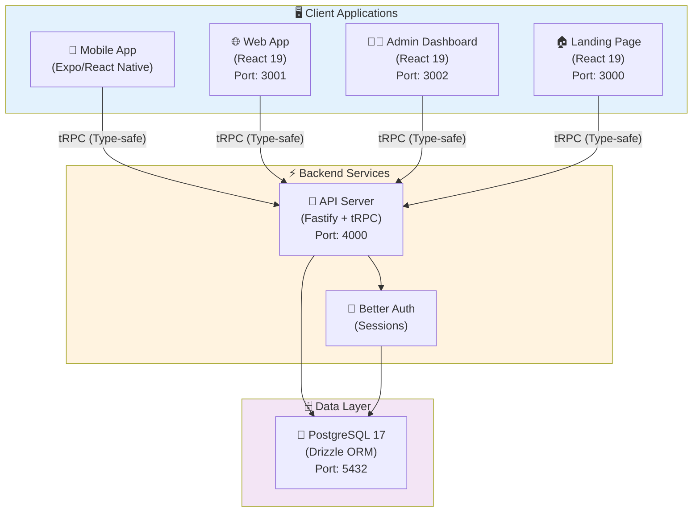

---

## 🛠️ Technology Stack

### 🎨 Frontend Technologies

<table>
<tr>
<td valign="top" width="50%">

#### 🌐 Web Applications

| Technology             | Version | Purpose               |
| ---------------------- | ------- | --------------------- |
| ⚛️ **React**           | 19.1.0  | UI framework          |
| 🗺️ **TanStack Router** | Latest  | File-based routing    |
| 🚀 **TanStack Start**  | Latest  | SSR capabilities      |
| ⚡ **Vite**            | 7.x     | Build tool            |
| 🎨 **Tailwind CSS**    | 4.x     | Styling               |
| ♿ **Radix UI**        | Latest  | Accessible primitives |
| 🔄 **React Query**     | Latest  | Server state          |
| 🐻 **Zustand**         | Latest  | Client state          |
| 📝 **React Hook Form** | Latest  | Form handling         |
| ✅ **Zod**             | 4.1.11  | Validation            |
| 🎭 **Lucide React**    | Latest  | Icons                 |

</td>
<td valign="top" width="50%">

#### 📱 Mobile Application

| Technology           | Version | Purpose              |
| -------------------- | ------- | -------------------- |
| 📱 **React Native**  | 0.81.4  | Mobile framework     |
| 🎯 **Expo**          | 54.x    | Development platform |
| 🗺️ **Expo Router**   | 6.x     | File-based routing   |
| 🎨 **NativeWind**    | Latest  | Tailwind for RN      |
| 🔄 **React Query**   | Latest  | Server state         |
| 🐻 **Zustand**       | Latest  | Client state         |
| 🔒 **SecureStore**   | Latest  | Secure storage       |
| 🔔 **Notifications** | Latest  | Push notifications   |
| 📍 **Location**      | Latest  | Geolocation          |

</td>
</tr>
</table>

### ⚙️ Backend Technologies

| Technology           | Version | Purpose            |
| -------------------- | ------- | ------------------ |
| ⚡ **Fastify**       | 5.6.0   | Web server         |
| 🔌 **tRPC**          | 11.4.0  | Type-safe API      |
| 🐘 **PostgreSQL**    | 17.x    | Database           |
| 🗄️ **Drizzle ORM**   | 0.44.4  | Database ORM       |
| 🔐 **Better Auth**   | 1.3.24  | Authentication     |
| ✅ **Zod**           | 4.1.11  | Schema validation  |
| 📝 **Pino**          | Latest  | Logging            |
| 🛡️ **Helmet**        | Latest  | Security headers   |
| 🚦 **Rate Limiting** | Latest  | Request throttling |

### 🔧 Infrastructure & Tooling

| Technology         | Version | Purpose                |
| ------------------ | ------- | ---------------------- |
| 🚀 **Turborepo**   | 2.5.8   | Monorepo orchestration |
| 📦 **pnpm**        | 10.17.1 | Package manager        |
| 📘 **TypeScript**  | 5.9.3   | Type safety            |
| ✨ **Biome**       | 2.2.4   | Linting & formatting   |
| 📧 **React Email** | 4.2.12  | Email templates        |
| 📊 **PostHog**     | Latest  | Analytics              |
| 🐳 **Docker**      | Latest  | Containerization       |

---

## 📁 Monorepo Structure

### 📂 Workspace Organization

```
📦 voltig-turbo/
┣━━ 📱 apps/                      # Application layer
┃   ┣━━ mobile/                   # React Native mobile app
┃   ┣━━ app/                      # Main web application
┃   ┣━━ admin/                    # Admin dashboard
┃   ┣━━ landing/                  # Marketing website
┃   ┗━━ server/                   # Fastify API server
┣━━ 📦 packages/                  # Shared packages
┃   ┣━━ api/                      # tRPC API definitions
┃   ┣━━ auth/                     # Authentication config
┃   ┣━━ db/                       # Database schemas (Drizzle)
┃   ┣━━ web-ui/                   # React component library (46+)
┃   ┣━━ emails/                   # Email templates (React Email)
┃   ┣━━ validators/               # Shared Zod schemas
┃   ┗━━ analytics/                # PostHog integration
┗━━ 🔧 tooling/                   # Build & development tools
    ┣━━ tsconfig/                 # TypeScript configurations
    ┣━━ tailwind-config/          # Tailwind CSS v4 config
    ┗━━ biome-config/             # Biome linting config
```

### 🔗 Dependency Graph

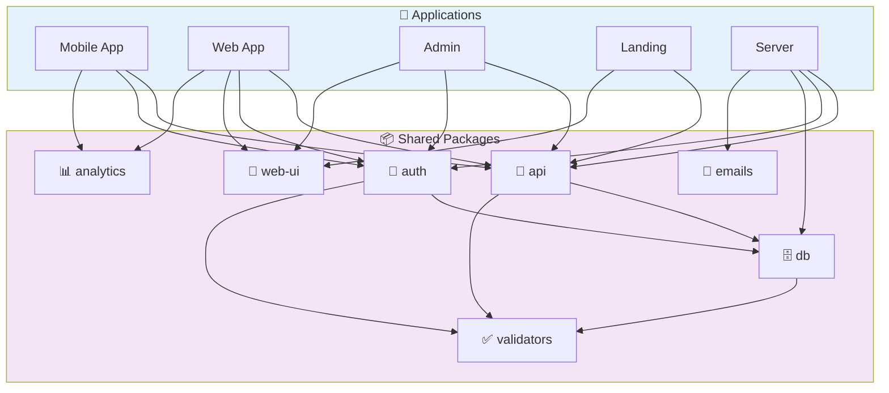

---

## 🔄 Data Flow

### 🔐 Authentication Flow

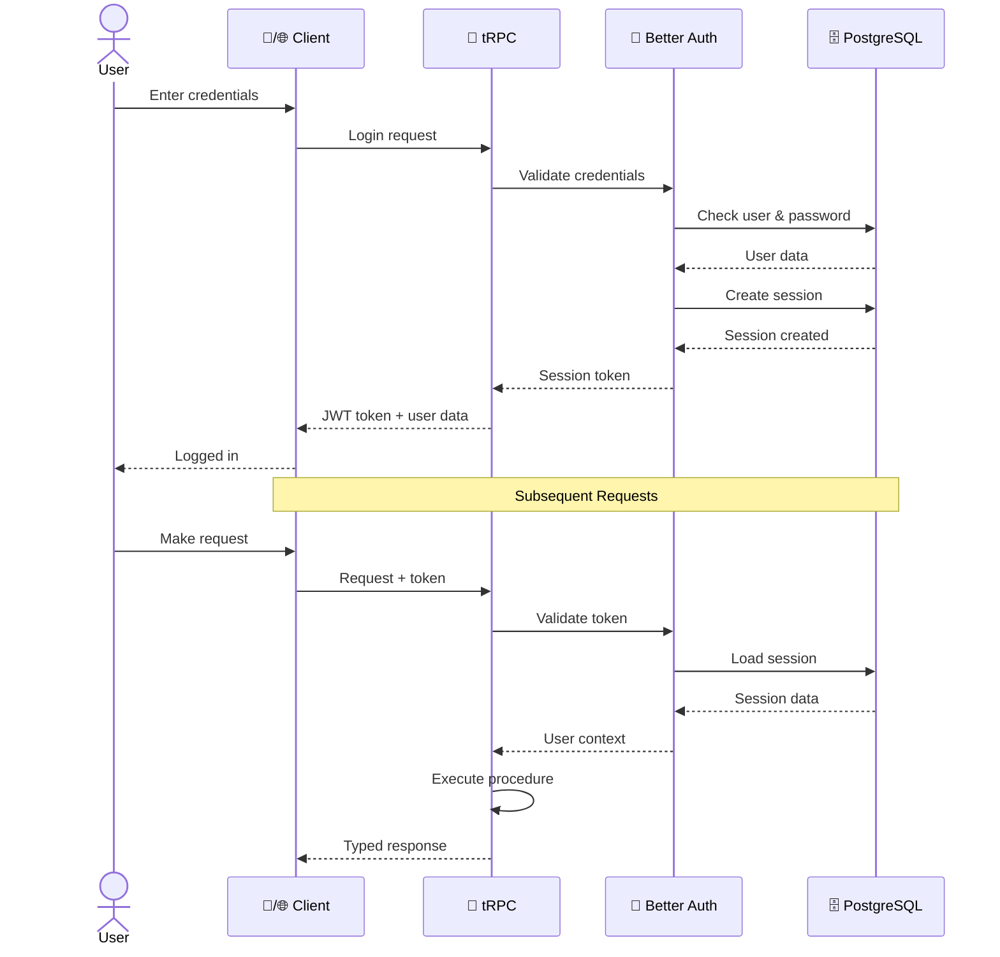

### ⚡ API Request Flow

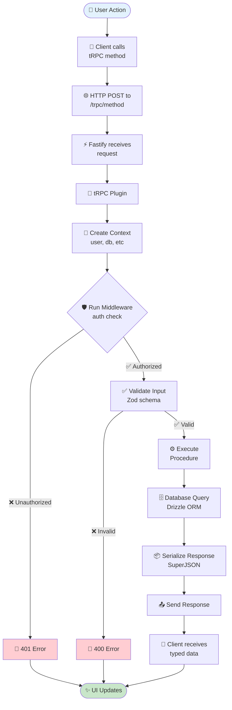

---

## 🗄️ Database Architecture

### 📊 Schema Organization

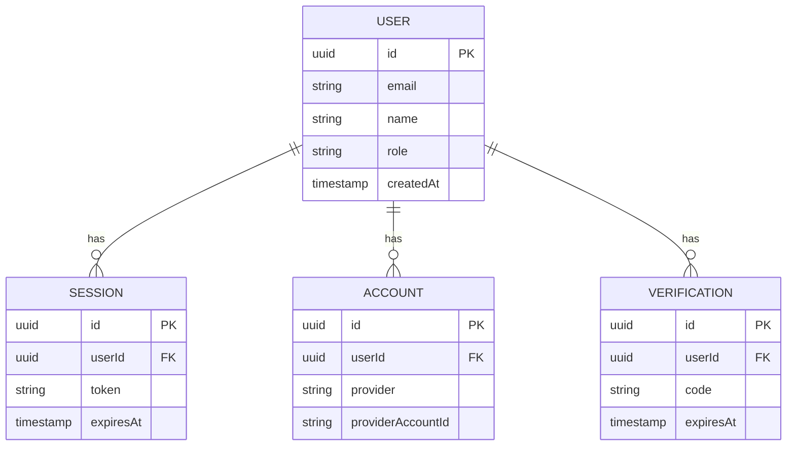

### 🔧 Database Configuration

| Feature             | Implementation | Notes                              |
| ------------------- | -------------- | ---------------------------------- |
| **Driver**          | `postgres.js`  | High-performance PostgreSQL driver |
| **Pool Size**       | Auto-managed   | Dynamically scales connections     |
| **SSL**             | Configurable   | Per-environment SSL settings       |
| **Migrations**      | Drizzle Kit    | Version-controlled schema changes  |
| **Type Generation** | Drizzle        | Automatic TypeScript types         |

---

## 🔒 Security Architecture

### 🛡️ Security Layers

```mermaid
graph TB
    subgraph Layer1["🌐 Layer 1: Transport Security"]
        HTTPS[HTTPS in Production]
        Cookies[Secure Cookies<br/>httpOnly, sameSite]
        CORS[CORS Whitelist]
    end

    subgraph Layer2["🔐 Layer 2: Authentication"]
        BetterAuth[Better Auth<br/>Session Management]
        Hashing[Password Hashing<br/>bcrypt]
        EmailVerif[Email Verification]
        SessionExp[Session Expiry<br/>7 days]
    end

    subgraph Layer3["👤 Layer 3: Authorization"]
        RBAC[Role-Based Access<br/>admin/merchant/customer]
        Protected[tRPC Protected<br/>Procedures]
        Ownership[Resource Ownership<br/>Checks]
    end

    subgraph Layer4["✅ Layer 4: Input Validation"]
        Zod[Zod Schema<br/>Validation]
        SQLPrevention[SQL Injection<br/>Prevention ORM]
        XSSPrevention[XSS Prevention<br/>React Escaping]
    end

    subgraph Layer5["🚦 Layer 5: Rate Limiting"]
        RateLimit[Fastify Rate Limit]
        IPThrottle[Per-IP Throttling]
        ConfigLimits[Configurable Limits]
    end

    subgraph Layer6["🔐 Layer 6: Security Headers"]
        Helmet[Helmet Middleware]
        CSP[Content Security<br/>Policy]
        HSTS[HTTP Strict<br/>Transport Security]
        XFrame[X-Frame-Options]
    end

    Layer1 --> Layer2
    Layer2 --> Layer3
    Layer3 --> Layer4
    Layer4 --> Layer5
    Layer5 --> Layer6

    style Layer1 fill:#ffebee
    style Layer2 fill:#fce4ec
    style Layer3 fill:#f3e5f5
    style Layer4 fill:#ede7f6
    style Layer5 fill:#e8eaf6
    style Layer6 fill:#e3f2fd
```

### 🔐 Security Features Summary

<table>
<tr>
<td width="50%">

**🌐 Transport & Network**

- ✅ HTTPS enforced in production
- ✅ Secure cookie configuration
- ✅ CORS whitelist protection
- ✅ Rate limiting per IP

</td>
<td width="50%">

**🔒 Authentication & Authorization**

- ✅ Better Auth integration
- ✅ bcrypt password hashing
- ✅ Email verification required
- ✅ Role-based access control

</td>
</tr>
<tr>
<td width="50%">

**✅ Input & Data Validation**

- ✅ Zod schema validation
- ✅ SQL injection prevention
- ✅ XSS attack prevention
- ✅ Type-safe API calls

</td>
<td width="50%">

**🛡️ Headers & Protection**

- ✅ Helmet security headers
- ✅ Content Security Policy
- ✅ HSTS enabled
- ✅ X-Frame-Options set

</td>
</tr>
</table>

---

## 🎯 Type Safety

### 🔗 End-to-End Type Flow

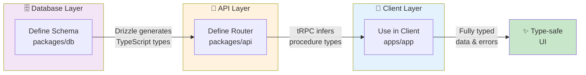

### 📝 Type Safety Example

```typescript
// 1️⃣ Define schema (packages/db)
export const todo = pgTable("todo", {
  id: uuid("id").primaryKey(),
  title: text("title").notNull(),
  completed: boolean("completed").default(false),
});

// 2️⃣ Define API (packages/api)
export const todoRouter = router({
  list: publicProcedure.query(async ({ ctx }) => {
    return ctx.db.query.todo.findMany();
  }),
});

// 3️⃣ Use in client (apps/app)
const { data } = api.todo.list.useQuery();
//    ^? data: Todo[] | undefined (fully typed!)
//       ✨ Autocomplete, refactoring, type checking!
```

### 🔧 Type Generation Pipeline

| Layer              | Tool        | Output                               |
| ------------------ | ----------- | ------------------------------------ |
| 🗄️ **Database**    | Drizzle Kit | Introspects PostgreSQL → TS types    |
| 🔌 **API**         | tRPC        | Infers types from router definitions |
| 📝 **Forms**       | Zod         | Schema → TypeScript types            |
| 🌍 **Environment** | @t3-oss/env | Validates env vars at build time     |
| 📦 **Packages**    | TypeScript  | Strict mode + path aliases           |

---

## ⚡ Performance Optimizations

### 🚀 Optimization Strategy

<table>
<tr>
<td valign="top" width="33%">

#### 🌐 Frontend

**Code Optimization**

- ✂️ Route-based code splitting
- 🌳 Automatic tree shaking (Vite)
- 🖼️ WebP images + lazy loading
- 🧠 React.memo optimization
- 📜 Virtual lists (react-window)

**Caching**

- 💾 React Query cache
- 🔄 Stale-while-revalidate
- 📦 Service worker (optional)

</td>
<td valign="top" width="33%">

#### ⚙️ Backend

**Database**

- 🔌 Connection pooling
- 📊 Optimized SQL queries
- 🗄️ Indexed columns
- 📈 Query planning

**API**

- 🗜️ Response compression
- 🚦 Rate limiting
- 💾 Response caching
- ⚡ Async operations

</td>
<td valign="top" width="33%">

#### 📱 Mobile

**Runtime**

- ⚡ Hermes engine
- 🎨 60fps animations
- 🧵 UI thread optimization
- 📦 Metro tree shaking

**Assets**

- 🖼️ Image caching
- 📦 Bundle optimization
- 🔄 Code push updates
- 💾 Persistent storage

</td>
</tr>
</table>

### 📊 Performance Metrics

| Metric                           | Target  | Tool            |
| -------------------------------- | ------- | --------------- |
| **FCP** (First Contentful Paint) | < 1.5s  | Lighthouse      |
| **TTI** (Time to Interactive)    | < 3.0s  | Lighthouse      |
| **Bundle Size** (Web)            | < 200KB | Vite build      |
| **API Response**                 | < 200ms | Pino logs       |
| **Database Query**               | < 50ms  | Drizzle metrics |

---

## 🔄 State Management Strategy

### 📊 State Architecture

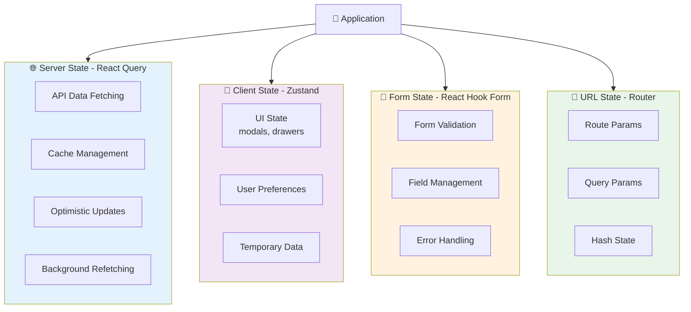

### 🔍 State Management Examples

#### 🌐 Server State (React Query + tRPC)

```typescript
// ✅ Fetch data with automatic caching and refetching
const { data, isLoading, error } = api.todo.list.useQuery();

// ✅ Optimistic updates
const mutation = api.todo.create.useMutation({
  onMutate: async (newTodo) => {
    await utils.todo.list.cancel();
    const previous = utils.todo.list.getData();
    utils.todo.list.setData(undefined, (old) => [...old, newTodo]);
    return { previous };
  },
});
```

#### 🐻 Client State (Zustand)

```typescript
// ✅ Simple, performant global state
const useStore = create((set) => ({
  isModalOpen: false,
  currentTheme: "light",
  openModal: () => set({ isModalOpen: true }),
  closeModal: () => set({ isModalOpen: false }),
  toggleTheme: () =>
    set((state) => ({
      currentTheme: state.currentTheme === "light" ? "dark" : "light",
    })),
}));
```

#### 📝 Form State (React Hook Form)

```typescript
// ✅ Type-safe forms with Zod validation
const form = useForm({
  resolver: zodResolver(todoSchema),
  defaultValues: { title: "", completed: false },
});

const onSubmit = form.handleSubmit((data) => {
  // data is fully typed!
  mutation.mutate(data);
});
```

### 📋 State Management Guidelines

| State Type          | Use When         | Tool            | Example                     |
| ------------------- | ---------------- | --------------- | --------------------------- |
| 🌐 **Server State** | Data from API    | React Query     | User list, todos, products  |
| 🐻 **Client State** | UI & preferences | Zustand         | Modal state, theme, sidebar |
| 📝 **Form State**   | Form management  | React Hook Form | Login, signup, settings     |
| 🔗 **URL State**    | Shareable state  | Router          | Search filters, pagination  |

---

## 🚀 Deployment Architecture

### 🛠️ Development Environment

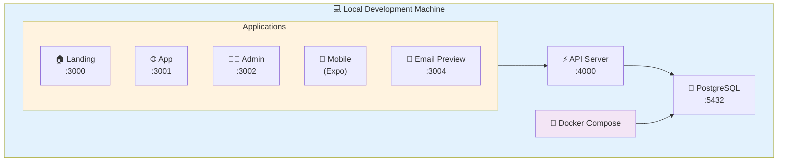

### 🌐 Production Architecture (Recommended)

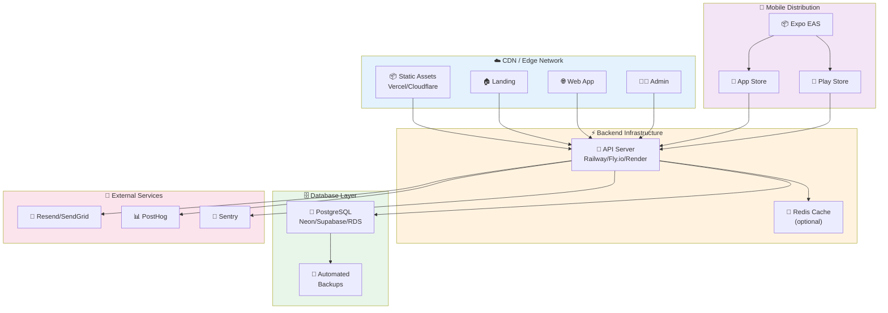

### 🔧 Deployment Options

| Component         | Recommended Platform | Alternative               |
| ----------------- | -------------------- | ------------------------- |
| 🏠 **Landing**    | Vercel               | Netlify, Cloudflare Pages |
| 🌐 **Web Apps**   | Vercel               | Netlify, Render           |
| 👨‍💼 **Admin**      | Vercel               | Netlify                   |
| ⚡ **API Server** | Railway              | Fly.io, Render, AWS       |
| 🐘 **Database**   | Neon                 | Supabase, Railway, RDS    |
| 📱 **Mobile**     | Expo EAS             | Manual builds             |
| 📧 **Emails**     | Resend               | SendGrid, Postmark        |
| 📊 **Analytics**  | PostHog Cloud        | Self-hosted               |

---

## 📈 Scalability & Monitoring

### 🔄 Scaling Strategy

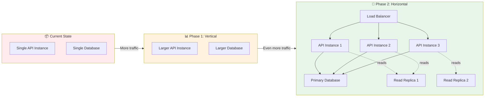

### 💾 Caching Strategy

| Layer                   | Technology  | TTL    | Use Case              |
| ----------------------- | ----------- | ------ | --------------------- |
| 🌐 **Client**           | React Query | 5 min  | API responses         |
| ☁️ **CDN**              | Cloudflare  | 1 year | Static assets         |
| ⚡ **API**              | In-memory   | 1 min  | Expensive queries     |
| 🗄️ **Database**         | PostgreSQL  | N/A    | Query results         |
| 💾 **Redis** (optional) | Redis       | Varies | Sessions, rate limits |

### 👀 Monitoring & Observability

<table>
<tr>
<td valign="top" width="33%">

#### 📝 Logging

**Implementation**

- 📊 Structured logs (Pino)
- 🔍 JSON format
- 🔗 Correlation IDs
- 🚨 Error tracking (Sentry)

**Log Levels**

- 🔴 Error
- 🟡 Warning
- 🔵 Info
- ⚪ Debug

</td>
<td valign="top" width="33%">

#### 📊 Metrics

**Performance**

- ⚡ API response times
- 🗄️ Database query times
- 💾 Cache hit rates
- 🚦 Error rates

**User Analytics**

- 📊 PostHog events
- 👤 User flows
- 📱 Device metrics
- 🌍 Geographic data

</td>
<td valign="top" width="33%">

#### ✅ Health Checks

**Endpoints**

- `/health` - Basic health
- `/health/db` - Database
- `/health/ready` - Readiness

**Checks**

- 🐘 Database connection
- 🔐 Auth service
- 📧 Email service
- 💾 Cache (if used)

</td>
</tr>
</table>

---

## 🔮 Future Architecture Considerations

### 🚀 Potential Enhancements

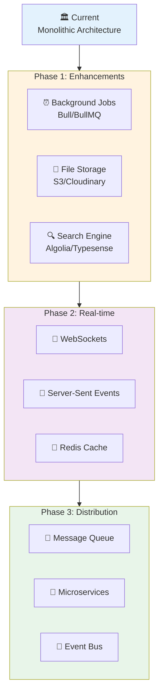

### 🛤️ Evolution Path

| Stage                   | Architecture      | When              | Benefits                 |
| ----------------------- | ----------------- | ----------------- | ------------------------ |
| **1️⃣ Current**          | Monolithic        | Now               | Simple, fast development |
| **2️⃣ Modular Monolith** | Organized modules | 10K+ users        | Better code organization |
| **3️⃣ Micro-frontends**  | Split web apps    | Multiple teams    | Independent deployments  |
| **4️⃣ Microservices**    | Split by domain   | 100K+ users       | Scale independently      |
| **5️⃣ Event-Driven**     | Message bus       | Complex workflows | Decoupled services       |

---

## 💡 Development Principles

### 🎯 Core Values

<table>
<tr>
<td valign="top" width="50%">

#### 🔒 Type Safety First

✅ **Benefits**

- TypeScript everywhere
- Catch bugs at compile time
- Self-documenting code
- Refactor with confidence

📝 **Implementation**

- Strict TypeScript config
- End-to-end type inference
- Zod schema validation
- tRPC type generation

</td>
<td valign="top" width="50%">

#### ⚡ Developer Experience

✅ **Benefits**

- Fast feedback loops
- Clear error messages
- Automated workflows
- Comprehensive docs

🛠️ **Tools**

- Hot Module Replacement (HMR)
- Biome for instant linting
- Turborepo for fast builds
- TypeScript for autocomplete

</td>
</tr>
<tr>
<td valign="top" width="50%">

#### ♻️ Code Reusability

✅ **Strategy**

- Shared packages
- Component library (46+ components)
- Utility functions
- Type definitions

📦 **Packages**

- `@repo/web-ui` - UI components
- `@repo/api` - API definitions
- `@repo/db` - Database schemas
- `@repo/validators` - Shared schemas

</td>
<td valign="top" width="50%">

#### 🚀 Performance by Default

✅ **Techniques**

- Lazy loading routes
- Automatic code splitting
- Optimized images
- Minimal bundle sizes

📊 **Monitoring**

- Lighthouse scores
- Web Vitals tracking
- Bundle size analysis
- Query performance

</td>
</tr>
</table>

---

<div align="center">

### 📚 Related Documentation

[🏠 Back to README](../README.md) • [🚀 Deployment Guide](DEPLOYMENT.md) • [🤝 Contributing](../CONTRIBUTING.md)

---

**Last Updated:** 2025-10-02

_Made with ❤️ by the Voltig Turbo team_

</div>
